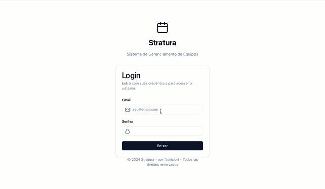

<br>
<br>

<p align="center">
    
</p>
<p align="center"><h4 align="center"><i>STRATURA</h1></p>
<p align="center">
	<em>Sistema de Gestão de Eventos e Escalas</em>
</p>
<p align="center">
    
    
    
</p>
<p align="center">
    
    
    
    
</p>
<p align="center">
    
    
    
</p>
<br>

##  Índice

- [Visão Geral](#-visão-geral)
- [Funcionalidades](#-funcionalidades)
- [Estrutura do Projeto](#-estrutura-do-projeto)
- [Começando](#-começando)
  - [Pré-requisitos](#-pré-requisitos)
  - [Instalação](#-instalação)
  - [Uso](#-uso)
- [Roadmap](#-roadmap)
- [Contribuindo](#-contribuindo)
- [Licença](#-licença)
- [Agradecimentos](#-agradecimentos)

---

##  Visão Geral

O Stratura é um sistema de gestão de eventos e escalas sendo projetado para otimizar a organização de equipes e eventos.

---

### Dashboard Preview (v0.0.1) 

<p align="center">
    
</p>

---

##  Funcionalidades

### Core
- **Autenticação**: localStorage _(temp)_
- **UI/UX**: Tailwind e Radix
- **Estado**: Context API
- **Roteamento**: React Router com proteção de rotas
- **Performance**: Code-splitting e lazy loading

### Módulos Implementados

#### Dashboard `/`
- Métricas básicas
- Lista de eventos recentes
- Indicadores de desempenho
- Visão geral do sistema

#### Pessoas `/pessoas`
- CRUD completo
- Gerenciamento de funções
- Histórico de participações
- Perfis de usuário

#### Eventos `/eventos`
- Criação e edição
- Definição de requisitos
- Acompanhamento de status
- Vinculação com escalas

#### Escalas `/escalas`
- Montagem manual de equipes
- Gestão de disponibilidade
- Sistema de confirmação
- Histórico de alocações

#### Relatórios `/relatorios`
- Visão geral do sistema
- Métricas por módulo
- Análises básicas
- Filtros por período

### Em Desenvolvimento
- Sistema de notificações
- Chat interno
- Exportação de relatórios
- Integração com API
- Gráficos e dashboards
- Alocação automática de escalas

---

##  Estrutura do Projeto

```sh
└── stratura/
    ├── src/
    │   ├── components/     # Componentes reutilizáveis
    │   ├── contexts/       # Contextos React
    │   ├── hooks/         # Hooks personalizados
    │   ├── lib/           # Utilitários e funções
    │   ├── pages/         # Páginas da aplicação
    │   ├── routes/        # Configuração de rotas
    │   ├── styles/        # Estilos globais
    │   └── types/         # Definições de tipos
    ├── public/            # Arquivos estáticos
    └── ...                # Arquivos de configuração
```

---

##  Começando

### Pré-requisitos

- Node.js 16+
- pnpm 9.15.0+
- Git

### Instalação

1. Clone o repositório:
```sh
git clone https://github.com/fabriciort/stratura
```

2. Entre no diretório:
```sh
cd stratura
```

3. Instale as dependências:
```sh
pnpm install
```

### Uso

Execute o projeto em modo de desenvolvimento:
```sh
pnpm dev
```

Acesse `http://localhost:5173` no navegador.

---

##  Roadmap

✅ **MVP 0.1 - Base Funcional**
- Interface base com Shadcn/UI
- Login simplificado
- Cadastros essenciais
- Escalas manuais
- Relatórios básicos

🚧 **0.2 - Experiência do Usuário**
- Notificações em tempo real
- Chat entre equipes
- Dashboards interativos
- UX aprimorada

🎯 **0.3 - Infraestrutura**
- Backend próprio
- Autenticação segura
- Controle de acessos
- Exportação de dados

🚀 **1.0 - Produto Completo**
- Alocação inteligente
- API documentada
- Cobertura de testes
- Docs técnica/usuário

🤖 **1.1 - Automação**
- Assistente de suporte
- Previsão de demanda
- Escalas otimizadas
- Detecção de conflitos

🧠 **1.2 - IA Avançada**
- Montagem smart de equipes
- Analytics de performance
- Chatbot para escalas
- Decisões automatizadas

---

##  Contribuindo

- **💬 [Participe das Discussões](https://github.com/fabriciort/stratura/discussions)**: Compartilhe ideias, feedback ou tire dúvidas.
- **🐛 [Reporte Problemas](https://github.com/fabriciort/stratura/issues)**: Envie bugs encontrados ou sugira novas funcionalidades.
- **💡 [Envie Pull Requests](https://github.com/fabriciort/stratura/pulls)**: Contribua com código ou documentação.

<details>
<summary>Guia de Contribuição</summary>

1. **Fork do Repositório**: Faça um fork do projeto para sua conta.
2. **Clone Local**: Clone o fork para sua máquina.
   ```sh
   git clone https://github.com/seu-usuario/stratura
   ```
3. **Nova Branch**: Crie uma branch para sua contribuição.
   ```sh
   git checkout -b feature/nova-funcionalidade
   ```
4. **Desenvolvimento**: Faça suas alterações localmente.
5. **Commit**: Commit com mensagem clara descrevendo as mudanças.
   ```sh
   git commit -m "Implementada nova funcionalidade"
   ```
6. **Push**: Envie as alterações para seu fork.
   ```sh
   git push origin feature/nova-funcionalidade
   ```
7. **Pull Request**: Crie um PR contra o repositório original.
</details>

---

##  Licença

Este projeto está sob a licença [MIT](LICENSE). Consulte o arquivo LICENSE para mais detalhes.

---

- Frameworks e bibliotecas utilizadas:
  - React
  - TypeScript
  - Tailwind CSS
  - Radix UI
  - Lucide Icons
  - React Router
  - ...